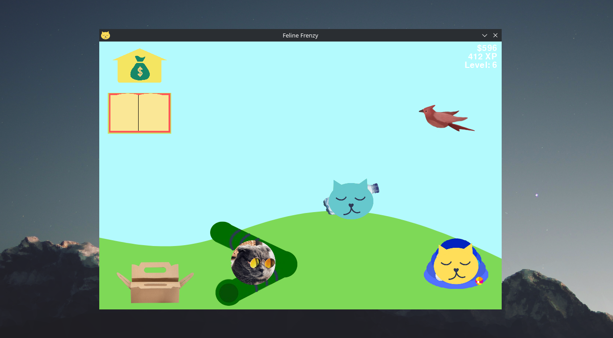
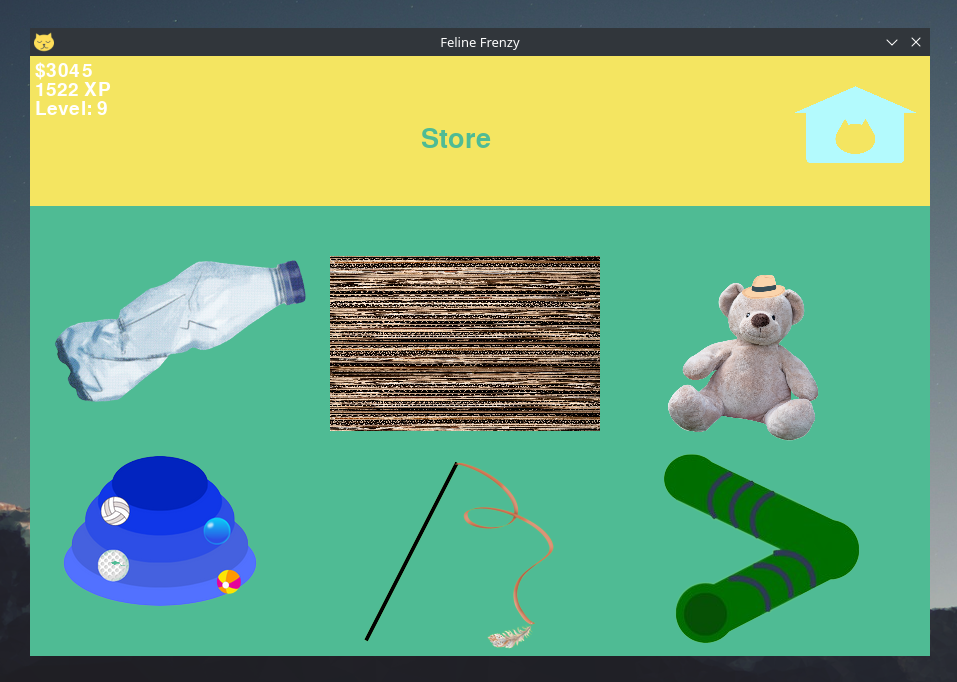
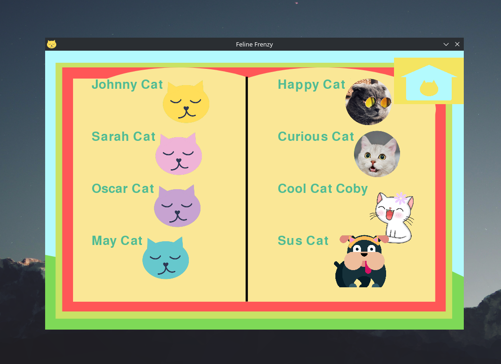
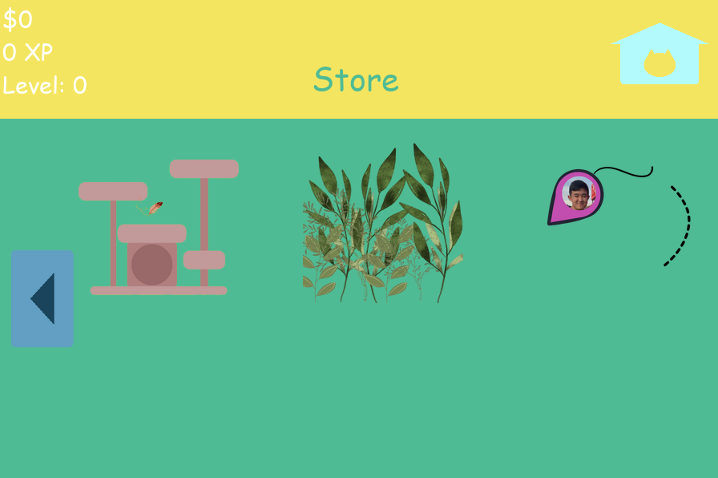

# FelineFrenzy
FelineFrenzy is a game where you have a yard where cats can visit.

## Objective
To unlock all of the cats

## How the Game Works
Different cats will come to your yard. That will give you XP.
When they leave, they will tip you some coins. With those coins, you can buy more cat toys.

More XP will result in unlocking new levels, unlocking more cats.

Press "m" to pause/unpause music

### Buy Items from the Store!

### Look through your Cat Book!

### Jan 16 24 Update!

#### More toys!

Including: Cat Tree, Catnip Forest, and DAXIMOUSE CHIME!

##### Daximouse Chime
Daximouse Chime is an animated mouse toy with my friend's (Dax) face on it.

#### Music!
The [Feline Frenzy Theme](https://soundcloud.com/ryan-moon-895940782/feline-frenzy-theme) by Ryan Moon (me) now plays in the background. It can be paused/unpaused by pressing the 'm' button.

### How to Download/Play
*Only available on Windows (for now...)
Download Zip  
Unzip  
Run the main.exe found in the 'dist' folder

### Credits
cool_cat_coby: Unsplash: Raoul Droog  
curious_cat: Unsplash: Hang Niu  
happy_cat: Pixabay: Edurs34  
sus_cat: Pixabay: ptra  

carboard image: Pexels: Aleksandar Pasaric  
teddy bear image: Pixabay: Pezibear  

Compiled using Pyinstaller

Music: Feline Frenzy Theme by Ryan Moon (me)
[CC BY-NC-ND 3.0 DEED](https://creativecommons.org/licenses/by-nc-nd/3.0/)  
Check the song out on [soundcloud!](https://soundcloud.com/ryan-moon-895940782/feline-frenzy-theme)
